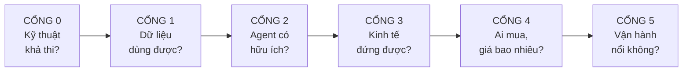

# RetailOps — Sổ Quyết Định & Chương Trình Nghiên Cứu

> **Phiên bản:** 0.2 · **Ngày:** 04/09/2026
> **Thay thế vai trò "kế hoạch" của** `retailops-architecture-blueprint.md` (v0.1) — bản đó vẫn giữ nguyên giá trị làm **tài liệu kiến trúc tham chiếu**, đọc sau khi qua Cổng 2.

---

## Cách dùng tài liệu này

Đây **không phải** kế hoạch thi công. Đây là danh sách những gì **chưa biết**, sắp xếp theo thứ tự phải biết, kèm cách tự tìm ra.

Nguyên tắc: **không viết dòng code nào cho một quyết định mà câu hỏi chặn nó chưa có đáp án.**

Mỗi câu hỏi có 5 phần:

| Trường | Nghĩa |
|---|---|
| **Chặn gì** | Không trả lời được thì không quyết định được điều gì |
| **Tìm ở đâu** | Cách cụ thể để tự tìm — không phải "nghiên cứu thêm" |
| **Công sức** | ⏱️ giờ · 📅 ngày · 📆 tuần |
| **Nếu đáp án là A / B / C** | Kế hoạch đổi thế nào theo từng đáp án |
| **Trạng thái** | ⬜ chưa · 🔄 đang · ✅ xong |

### Sáu cổng



**Không nhảy cổng.** Mỗi cổng có thể trả lời "dừng lại" — và dừng ở Cổng 0 rẻ hơn dừng ở Cổng 4 rất nhiều.

### Bảng tổng — 34 câu hỏi

| Cổng | Câu hỏi | Chặn | Công sức |
|---|---|---|---|
| 0 | Q0.1–Q0.6 | Toàn bộ kiến trúc T1 | 📅 2–4 ngày |
| 1 | Q1.1–Q1.5 | Khối lượng công normalize | 📅 3–5 ngày |
| 2 | Q2.1–Q2.6 | Sản phẩm có lý do tồn tại không | 📆 3–5 tuần |
| 3 | Q3.1–Q3.7 | Mô hình giá, chọn model | 📆 1–2 tuần |
| 4 | Q4.1–Q4.6 | Thị trường, định vị | 📆 2–4 tuần |
| 5 | Q5.1–Q5.4 | Khả năng scale | 📅 2–3 ngày |

---

# CỔNG 0 — Kỹ thuật có khả thi không

> **Đây là cổng rẻ nhất và quan trọng nhất.** Vài ngày đọc tài liệu có thể tiết kiệm vài tháng code sai hướng.

## Q0.1 — API KiotViet mở tới đâu? ⬜

**Chặn gì:** Toàn bộ T1. Và gián tiếp chặn T2 (thiết kế đồng bộ), P2 (ghi ngược), và cả cách hiển thị tồn kho trên giao diện.

**Tìm ở đâu:**
1. Tài liệu API công khai của KiotViet (tìm "KiotViet API documentation", "KiotViet developer")
2. Đăng nhập tài khoản KiotViet của Khải Kids → tìm mục tích hợp / API / ứng dụng
3. Xem KiotViet có chợ ứng dụng (app marketplace) không — nếu có, đọc điều khoản dành cho nhà phát triển
4. Nếu tài liệu mập mờ: liên hệ bộ phận kỹ thuật KiotViet hỏi thẳng

**Cần trả lời cụ thể:**

| Mục | Đáp án |
|---|---|
| Có API công khai cho bên thứ ba? | |
| Cơ chế xác thực (API key / OAuth)? | |
| Shop tự cấp quyền được, hay phải qua duyệt đối tác? | |
| **Đọc được**: sản phẩm, biến thể, tồn kho, đơn, khách? | |
| **Ghi được**: nhập kho, đổi giá, tạo SP, tạo đơn? | |
| Có webhook không? Sự kiện nào? | |
| Rate limit? | |
| Có sandbox để thử không? | |
| Chi phí (miễn phí / theo gói / phải nâng gói KiotViet)? | |

**Công sức:** ⏱️ 3–6 giờ đọc tài liệu, 📅 vài ngày nếu phải chờ phản hồi

**Nếu đáp án là:**

| Kịch bản | Hệ quả |
|---|---|
| **A. Đọc + ghi + webhook** | Kiến trúc như blueprint v0.1. Mở được P2 ghi ngược. Hiển thị được số tồn chính xác |
| **B. Chỉ đọc, không webhook** | Polling 5–15 phút. **Chỉ hiện "còn hàng / hết hàng"**, không hiện số. Không có ghi ngược qua KiotViet → cắt bỏ toàn bộ luồng staging cho nhập kho/đổi giá. Sản phẩm co lại thành "trợ lý tra cứu + báo cáo" |
| **C. Chỉ đọc, có webhook** | Tốt hơn B đáng kể — dữ liệu gần thời gian thực |
| **D. Phải qua chương trình đối tác** | Thêm thời gian xin duyệt (chưa biết bao lâu). Cân nhắc làm adapter khác trước |
| **E. Không có API cho bên ngoài** | **Đổi hoàn toàn.** Xem Q0.2 |

## Q0.2 — Nếu KiotViet không có API, đường thoát là gì? ⬜

**Chặn gì:** Có tiếp tục dự án hay không, nếu Q0.1 ra đáp án E.

**Tìm ở đâu:**
1. KiotViet có xuất báo cáo Excel/CSV định kỳ không? Xuất được những gì?
2. Có công cụ đồng bộ của bên thứ ba nào đang cắm vào KiotViet không? Họ làm bằng cách nào?
3. Có phần mềm quản lý đa kênh Việt Nam nào đã tích hợp KiotViet không? → họ có thể trở thành **nguồn T1 thay thế**

**Công sức:** ⏱️ 2–4 giờ

**Nếu đáp án là:**
- **Có xuất file** → adapter Excel/CSV thành adapter chính thay vì phụ. Chấp nhận dữ liệu không realtime
- **Có bên thứ ba đã tích hợp** → cân nhắc đọc từ họ (một adapter thay vì tự đấu nối)
- **Không có gì** → bỏ KiotViet, đổi adapter đầu tiên sang WooCommerce (xem Q0.4)

## Q0.3 — API Sapo mở tới đâu? ⬜

**Chặn gì:** Adapter thứ ba, và ước lượng độ lớn thị trường có thể phục vụ.

**Tìm ở đâu:** Giống Q0.1, áp cho Sapo.

**Công sức:** ⏱️ 2–4 giờ

**Vì sao hỏi sớm dù là adapter sau:** nếu **cả** KiotViet và Sapo đều đóng, mô hình "một lõi nhiều adapter" sụp — vì hai nguồn lớn nhất không cắm vào được. Biết sớm thì chuyển hướng sớm.

## Q0.4 — WooCommerce: plugin hay REST API? ⬜

**Chặn gì:** Hình dạng adapter Woo, và trải nghiệm cài đặt của khách.

**Tìm ở đâu:**
1. Tài liệu WooCommerce REST API — đọc/ghi được gì, xác thực thế nào
2. Quy trình xuất bản plugin lên WordPress.org — hay chỉ phát file .zip?
3. Dựng thử một site Woo local, gọi thử API

**Công sức:** 📅 1–2 ngày (có dựng thử)

**Nếu đáp án là:**
- **REST API đủ dùng** → không cần plugin cho phần đọc dữ liệu. Chỉ cần plugin nếu muốn nhúng giao diện vào wp-admin. **Đơn giản hơn nhiều**
- **Phải có plugin** → thêm việc: đóng gói, cập nhật, xử lý xung đột plugin

## Q0.5 — Tool calling: model nào đủ tin cậy? ⬜

**Chặn gì:** Chọn model, và qua đó chặn toàn bộ bài toán chi phí ở Cổng 3.

> Đây là câu hỏi **thực nghiệm**, không tra được trên blog. Gates bảo vệ khỏi *dữ liệu sai*, nhưng không bảo vệ khỏi *model gọi nhầm tool, quên gọi tool, hoặc lặp vô hạn*.

**Tìm ở đâu:** Không tìm được — **phải đo**. Xem Q2.1 (bộ eval). Câu hỏi này phụ thuộc Q2.1.

**Cần đo, trên cùng một bộ eval:**

| Chỉ tiêu | Vì sao |
|---|---|
| Tỷ lệ gọi đúng tool | Sai là trả lời lạc đề |
| Tỷ lệ gọi đúng tham số | Sai là ra kết quả sai |
| Tỷ lệ quên gọi tool, trả lời từ trí nhớ | **Nguy hiểm nhất** — model bịa |
| Số vòng trung bình / lượt | Ảnh hưởng trực tiếp chi phí |
| Tỷ lệ lặp vô hạn | Đốt token |
| Chất lượng tiếng Việt (chấm tay) | |
| Độ trễ p50, p95 | |

**Ứng viên:** DeepSeek V4-Flash · DeepSeek V4-Pro · Claude Haiku 4.5 · Claude Sonnet 5

**Công sức:** 📅 1 ngày sau khi có bộ eval, vài đô tiền token

## Q0.6 — Dữ liệu khách ra nước ngoài: rào cản pháp lý và thương mại? ⬜

**Chặn gì:** Có được dùng model giá rẻ đặt ở nước ngoài không — ảnh hưởng trực tiếp biên lợi nhuận.

**Bối cảnh:** Prompt chứa dữ liệu kinh doanh của shop: tên khách, số điện thoại, lịch sử mua, doanh thu, có thể cả giá vốn.

**Tìm ở đâu:**
1. Đọc Nghị định 13/2023/NĐ-CP về bảo vệ dữ liệu cá nhân — phần chuyển dữ liệu ra nước ngoài
2. Xem các SaaS Việt Nam đang dùng API nước ngoài công bố điều khoản thế nào
3. **Hỏi luật sư** — đây là chỗ tôi không tư vấn được, và nó ảnh hưởng tới hợp đồng với mọi khách

**Cần trả lời:**
- [ ] Chuyển dữ liệu cá nhân ra nước ngoài cần thủ tục gì?
- [ ] Có phải xin đồng ý riêng của chủ thể dữ liệu (khách của shop) không?
- [ ] Nếu ẩn danh hoá (băm số điện thoại, bỏ tên) trước khi gửi model thì có thoát diện điều chỉnh không?
- [ ] Khách hàng doanh nghiệp có hỏi câu này không? (xem Q4.3)

**Công sức:** 📅 1–2 ngày đọc + 1 buổi tư vấn

**Nếu đáp án là:**
- **Ẩn danh hoá là đủ** → thiết kế lớp ẩn danh trước khi gửi prompt. Tự do chọn model theo giá
- **Phải xin đồng ý riêng** → thêm bước vào onboarding, thêm điều khoản hợp đồng
- **Hạn chế nặng với nhà cung cấp cụ thể** → thu hẹp lựa chọn model, chi phí tăng

> 💡 **Thiết kế phòng xa, rẻ:** làm lớp ẩn danh hoá ngay từ đầu (băm số điện thoại, bỏ tên khách khỏi prompt trừ khi thật cần). Agent hầu như không cần biết tên khách để trả lời câu hỏi về sản phẩm.

---

# CỔNG 1 — Dữ liệu có dùng được không

> Agent chỉ tốt bằng dữ liệu nó đọc. Cổng này quyết định khối lượng công normalize — hạng mục hay bị ước lượng thấp nhất.

## Q1.1 — Dữ liệu Khải Kids bẩn tới mức nào? ⬜

**Chặn gì:** Ước lượng công normalize, và thiết kế `Normalizer`.

**Tìm ở đâu:** Xuất toàn bộ danh mục sản phẩm từ KiotViet ra Excel, rồi tự đếm.

**Cần đếm cụ thể:**

| Câu hỏi | Số | % |
|---|---|---|
| Tổng số sản phẩm | | |
| Tổng số biến thể | | |
| SP có size nằm trong tên (không phải trường riêng) | | |
| SP có màu nằm trong tên | | |
| SP thiếu giá | | |
| SP thiếu tồn kho | | |
| SP không có ảnh | | |
| SP không có mô tả | | |
| Cặp SP nghi trùng (cùng mẫu, hai mã) | | |
| Số cách đặt tên khác nhau cho cùng một khái niệm | | |
| Mã hàng có theo quy tắc nào không | | |

**Công sức:** 📅 1 ngày (xuất + đếm bằng script)

**Nếu đáp án là:**
- **< 20% có vấn đề** → normalize bằng quy tắc đơn giản, 2–3 ngày
- **20–50%** → cần từ điển + regex + màn hình cho chủ shop xác nhận. 1–2 tuần
- **> 50%** → **dọn dữ liệu là sản phẩm riêng, bán trước cả agent.** Và ước lượng lại toàn bộ lộ trình

## Q1.2 — Quy tắc tách size/màu có tổng quát hoá được không? ⬜

**Chặn gì:** Adapter có dùng lại được cho khách khác không — tức là mô hình có scale được không.

**Tìm ở đâu:**
1. Viết bộ quy tắc tách trên dữ liệu Khải Kids
2. Xin dữ liệu mẫu của 2–3 shop khác cùng ngành (bạn bè, hội nhóm)
3. Chạy bộ quy tắc đó lên dữ liệu của họ, đo tỷ lệ đúng

**Công sức:** 📅 2–3 ngày

**Nếu đáp án là:**
- **Quy tắc chạy tốt trên shop khác** → ✅ adapter dùng lại được. Mô hình sản phẩm đứng vững
- **Mỗi shop một kiểu, phải viết riêng** → 🔴 **cảnh báo lớn.** Đây là dấu hiệu mô hình nghiêng về outsource. Cần thiết kế lại: dùng màn hình ánh xạ cho chủ shop tự khai báo quy tắc của họ, thay vì bạn viết code cho từng shop

## Q1.3 — Có bao nhiêu loại câu hỏi cần dữ liệu mà KiotViet KHÔNG có? ⬜

**Chặn gì:** Phạm vi thật của agent, và kỳ vọng phải đặt với khách.

**Ví dụ dữ liệu KiotViet có thể không có:** bảng quy đổi size theo tuổi · chất liệu · độ tuổi phù hợp · hướng dẫn bảo quản · chính sách đổi trả · thông tin so sánh mẫu.

**Tìm ở đâu:** Lấy 100 câu hỏi thật của khách (Q2.1), đánh dấu câu nào cần dữ liệu ngoài KiotViet.

**Công sức:** ⏱️ 2–3 giờ (làm cùng lúc với Q2.1)

**Nếu đáp án là:**
- **< 20%** → bổ sung bằng bảng tra cứu tĩnh do shop nhập
- **> 40%** → agent cần một kho tri thức riêng, không chỉ dữ liệu bán hàng. **Thêm một module chưa có trong blueprint** — phải ước lượng lại

## Q1.4 — Chấm điểm chất lượng dữ liệu thế nào cho có ý nghĩa? ⬜

**Chặn gì:** Màn hình onboarding, và khả năng bán dịch vụ dọn dữ liệu.

**Tìm ở đâu:** Tự thiết kế, nhưng phải kiểm chứng: điểm số có **tương quan** với chất lượng trả lời của agent không?

**Cách kiểm:** chấm điểm 10 sản phẩm, hỏi agent về từng cái, so điểm với chất lượng câu trả lời.

**Công sức:** 📅 1 ngày (sau khi có agent chạy)

## Q1.5 — Dữ liệu cần bao nhiêu dung lượng và đồng bộ mất bao lâu? ⬜

**Chặn gì:** Thiết kế job đồng bộ, chọn cấu hình máy chủ.

**Tìm ở đâu:** Đo trên Khải Kids: dung lượng dữ liệu, thời gian gọi API lấy toàn bộ, số bản ghi thay đổi mỗi ngày.

**Công sức:** ⏱️ 2–3 giờ (sau khi có adapter đọc)

**Suy ra:** nhịp đồng bộ hợp lý · đồng bộ toàn phần hay chỉ phần thay đổi · dung lượng DB cho 100 shop.
---

# CỔNG 2 — Agent có thật sự hữu ích không

> **Đây là cổng có thể trả lời "dừng lại".** Mọi thứ phía sau vô nghĩa nếu qua cổng này thất bại.
> Cổng này cần **người dùng thật**, không phải thử nghiệm trong phòng.

## Q2.1 — Khách và nhân viên thật sự hỏi những gì? ⬜

**Chặn gì:** Bộ eval · thiết kế skills · Q0.5 (đo model) · Q1.3 · Q3.2 (đo chi phí). **Đây là câu hỏi mở khoá nhiều thứ nhất.**

**Tìm ở đâu:** Đọc lại lịch sử tin nhắn Facebook/Zalo của Khải Kids, chép ra 100–200 câu hỏi thật, nguyên văn.

**Cách phân loại:**

| Nhóm | Ví dụ | Xử lý |
|---|---|---|
| **A. Tra cứu cố định** | "còn size 27 không" | Truy vấn T2, $0 |
| **B. Cần suy luận nhẹ** | "bé 4 tuổi đi size mấy" | Model rẻ |
| **C. Nhiều bước** | "bé hay ra mồ hôi chân, có mẫu nào thoáng dưới 200k" | Model mạnh hơn |
| **D. Ngoài dữ liệu** | "giày này giặt máy được không" | Cần kho tri thức riêng |
| **E. Không phải sản phẩm** | "shop ở đâu", "ship bao lâu" | Câu trả lời tĩnh |

**Đếm tỷ lệ mỗi nhóm.**

**Công sức:** 📅 1–2 ngày

**Nếu đáp án là:**
- **A + E chiếm > 60%** → 🎉 tin rất tốt. Phần lớn câu hỏi không cần model → chi phí thấp hơn nhiều bảng tính. Nhưng cũng có nghĩa **giá trị của agent thấp hơn tưởng** — một bot đơn giản có thể làm được
- **C + D chiếm > 40%** → agent thật sự cần thiết, nhưng đắt. Và D cần module chưa có
- **Câu hỏi phân tán, không lặp lại** → khó tự động hoá, cân nhắc lại

## Q2.2 — Nhân viên có chịu dùng không? ⬜

**Chặn gì:** Toàn bộ dự án. Đây là rủi ro R4 trong blueprint, xếp mức "Cao".

**Tìm ở đâu:** Không hỏi được — **phải quan sát**. Cho chạy bot nội bộ 2 tuần, rồi đo.

**Cần đo:**

| Chỉ tiêu | Ngưỡng đạt |
|---|---|
| Số lượt dùng / người / ngày | ≥ 5 |
| Số ngày dùng liên tục không bị nhắc | ≥ 10/14 ngày |
| Tỷ lệ câu trả lời được copy sang khách | ≥ 40% |
| Tỷ lệ quay lại hỏi lần 2 trong ngày | cao = tốt |

**Công sức:** 📆 2 tuần (chạy) + thời gian dựng bot

**Nếu đáp án là:**
- **Đạt ngưỡng** → ✅ đi tiếp
- **Dùng vài ngày rồi bỏ** → tìm nguyên nhân: chậm hơn cách cũ? trả lời sai? hay không tin? Mỗi nguyên nhân có cách sửa khác nhau
- **Không dùng ngay từ đầu** → 🔴 dừng lại. Xem xét lại toàn bộ định vị sản phẩm

## Q2.3 — Vì sao nhân viên KHÔNG dùng (nếu vậy)? ⬜

**Chặn gì:** Biết sửa gì. Câu hỏi này chỉ kích hoạt nếu Q2.2 thất bại.

**Tìm ở đâu:** Ngồi cạnh nhân viên quan sát 2–3 tiếng. Không hỏi "sao em không dùng" — họ sẽ trả lời cho vừa lòng. **Quan sát thao tác thật.**

**Các nguyên nhân thường gặp và cách sửa:**

| Nguyên nhân | Cách sửa |
|---|---|
| Chậm hơn tự tra | Tối ưu độ trễ, hoặc định tuyến câu đơn giản khỏi model |
| Trả lời sai vài lần → mất tin | Sửa prompt, thu hẹp phạm vi, nói rõ agent không biết gì |
| Phải mở app khác | Đưa vào chỗ họ đang làm việc (extension, bot trong nhóm chat) |
| Sợ bị thay thế | Đổi định vị, đổi cách giới thiệu |
| Không biết hỏi gì | Thêm nút gợi ý, câu hỏi soạn sẵn |

**Công sức:** 📅 1 ngày

## Q2.4 — Chủ shop có mở bảng tin thường xuyên không? ⬜

**Chặn gì:** Bảng tin là phần **miễn phí về chi phí nhưng đắt về giá trị** — nó là lý do khách không huỷ. Nếu không ai mở, giả định đó sai.

**Tìm ở đâu:** Đo trên chính mình trước (Khải Kids), rồi khách đầu tiên.

**Cần đo:** số lần mở/tuần · thời gian ở lại · phần nào được nhìn nhiều nhất · có bấm vào cảnh báo không.

**Công sức:** 📆 2 tuần đo

**Nếu đáp án là:**
- **Mở hàng ngày** → ✅ bảng tin là neo giữ khách. Củng cố mô hình credit (bảng tin miễn phí, agent tính credit)
- **Mở vài lần rồi thôi** → bảng tin không đủ giá trị → **mô hình credit lung lay**, vì khách hết credit sẽ chẳng còn gì để ở lại

## Q2.5 — Agent trả lời sai kiểu gì, và sai có nguy hiểm không? ⬜

**Chặn gì:** Có dám mở cho khách hàng cuối dùng không (shopping agent), hay chỉ dừng ở nội bộ.

**Tìm ở đâu:** Chạy bộ eval, phân loại **từng lỗi** theo mức nguy hiểm:

| Mức | Loại lỗi | Ví dụ |
|---|---|---|
| 🟢 Vô hại | Trả lời lạc đề, dài dòng | |
| 🟡 Khó chịu | Không tìm thấy dù có hàng | |
| 🟠 Nguy hiểm | Nói sai chính sách đổi trả | |
| 🔴 Nghiêm trọng | Nói sai giá, sai tồn kho | |

**Kỳ vọng:** nếu gates làm đúng việc, **mức 🔴 phải bằng 0** — vì con số do server bơm vào, model không chạm.

**Công sức:** 📅 1–2 ngày

**Nếu đáp án là:**
- **🔴 = 0, 🟠 hiếm** → có thể tính tới mở cho khách hàng cuối
- **Vẫn có 🔴** → gates có lỗ hổng. **Tìm và bịt trước khi làm bất cứ điều gì khác**

## Q2.6 — Bao nhiêu % câu hỏi agent trả lời được đúng và đủ? ⬜

**Chặn gì:** Có gì để bán không. Đây cũng là **tài sản bán hàng** mạnh nhất.

**Tìm ở đâu:** Chạy bộ eval Q2.1, chấm tay từng câu theo 3 mức: đúng và đủ · đúng nhưng thiếu · sai hoặc không trả lời được.

**Công sức:** 📅 1 ngày

**Ngưỡng tôi đề xuất để đi tiếp:** ≥ 80% ở mức "đúng và đủ", **và** 0% ở mức 🔴 của Q2.5.

> 💡 Con số này về sau trở thành câu bán hàng: *"agent trả lời được X% trong 200 câu khách hỏi thật của shop tôi"* — cụ thể, kiểm chứng được, và không phải marketing.

---

# CỔNG 3 — Kinh tế có đứng được không

## Q3.1 — Prefix thật to bao nhiêu? ⬜

**Chặn gì:** Toàn bộ bài toán chi phí. Ước lượng 8.000 token trong blueprint là **giả định của Claude, không phải số đo**.

**Tìm ở đâu:** Sau khi viết xong prompt + skills + tool definitions, dùng endpoint đếm token của nhà cung cấp.

**Công sức:** ⏱️ 1 giờ

**Vì sao quan trọng:** prefix 15.000 thay vì 8.000 → chi phí gần gấp đôi. Và prefix là thứ **cắt gọt được** — mỗi 1.000 token cắt đi là tiền tiết kiệm trên mọi lượt của mọi shop.

## Q3.2 — Tỷ lệ cache hit thật là bao nhiêu? ⬜

**Chặn gì:** Chi phí thật, và tính khả thi của gói 199k.

**Tìm ở đâu:** Đọc trường `cache_read_input_tokens` (Anthropic) hoặc `prompt_cache_hit_tokens` / `prompt_cache_miss_tokens` (DeepSeek) trong mỗi phản hồi. Ghi vào `credit_ledger`.

**Dấu hiệu cần biết:** bằng 0 ở lượt thứ hai nghĩa là **prefix đã đổi** — có gì đó động vào phần đáng lẽ phải tĩnh.

**Công sức:** ⏱️ vài giờ (sau khi có agent chạy)

## Q3.3 — Prefix dùng chung giữa các shop có thật sự hit không? ⬜

**Chặn gì:** Đây có thể là **đòn bẩy chi phí lớn nhất ở quy mô 100 shop** — lớn hơn cả việc đổi model.

**Giả thuyết cần kiểm:** nếu phần tĩnh (prompt + skills + tool defs) **byte-identical** giữa mọi shop, và cấu hình riêng shop (`brand_name`, `brand_voice`, bối cảnh) đặt **sau** điểm cắt cache, thì mọi shop dùng chung một cache → shop đông kéo cache nóng cho shop vắng.

```
❌ SAI — prefix riêng từng shop
   [prompt + skills + "Khải Kids" + giọng riêng]
   ─── điểm cắt ───
   → 100 shop = 100 cache riêng

✅ ĐÚNG — prefix chung
   [prompt + skills + tool defs]     ← giống hệt mọi shop
   ─── điểm cắt ───
   [brand_name, brand_voice, context] ← riêng shop
   → 100 shop chung 1 cache
```

**Tìm ở đâu:** Không suy luận được — **phải thử**. Gọi API với hai `shop_id` khác nhau nhưng prefix giống hệt, đọc `cache_read_input_tokens` của lần thứ hai.

**Công sức:** ⏱️ 1–2 giờ

**Nếu đáp án là:**
- **Hit** → thiết kế prompt theo cách này ngay từ đầu. Cache hit gần 100%, chi phí giảm mạnh
- **Không hit** (cache tách theo phiên hoặc theo thứ khác) → mỗi shop tự chịu cache write của mình. Với shop dùng thưa, cache luôn nguội → chi phí cao hơn bảng tính đáng kể

## Q3.4 — Bao nhiêu % câu hỏi thoát được model hoàn toàn? ⬜

**Chặn gì:** Chi phí thật, và có làm định tuyến hay không.

**Tìm ở đâu:** Từ phân loại Q2.1 — nhóm A và E là nhóm thoát được. Nhưng phải kiểm: có nhận diện được chúng **trước khi** gọi model không?

**Cách nhận diện, xếp theo độ phức tạp:**
1. Khớp mẫu đơn giản ("doanh thu hôm nay", "còn bao nhiêu")
2. Phân loại bằng model rẻ nhất, rồi mới định tuyến
3. Nút bấm sẵn trên giao diện thay vì gõ tự do ← **rẻ nhất và chắc nhất**

**Công sức:** 📅 1 ngày

> 💡 Cách 3 đáng làm trước. Mỗi cảnh báo có nút `[Xử lý]`, mỗi câu hỏi thường gặp có nút riêng — người dùng bấm thay vì gõ, và bấm thì không tốn gì.

## Q3.5 — Giá DeepSeek thật là bao nhiêu, và giờ cao điểm ảnh hưởng thế nào? ⬜

**Chặn gì:** Chọn model, và biên lợi nhuận gói 199k.

**Bối cảnh — nguồn đang mâu thuẫn:**
- Nguồn tháng 6/2026: V4-Flash $0.14 input / $0.28 output per MTok
- Nguồn cuối tháng 8 và đầu tháng 9/2026: từ 16/08/2026 chuyển sang giá theo giờ, V4-Flash thành $0.007 cache-hit / $0.22 cache-miss / $0.66 output ở **giờ thấp điểm**, và $0.014 / $0.44 / $1.32 ở **giờ cao điểm**
- Một nguồn ghi DeepSeek đã báo hiệu đợt tăng giá rộng hơn nhưng chưa công bố mức và ngày

⚠️ **Phát hiện quan trọng:** giờ cao điểm là 01:00–04:00 và 06:00–10:00 UTC, thứ Hai đến thứ Sáu. Quy sang giờ Việt Nam (UTC+7):

```
01:00–04:00 UTC  →  08:00–11:00 giờ VN
06:00–10:00 UTC  →  13:00–17:00 giờ VN
```

**Đó chính xác là giờ shop mở cửa.** Nghĩa là mức giá thấp điểm gần như không áp dụng được — phải lấy giá cao điểm làm cơ sở tính toán.

**Tìm ở đâu:** `api-docs.deepseek.com` — trang giá chính thức. Không tin blog bên thứ ba cho việc lập kế hoạch tài chính.

**Công sức:** ⏱️ 1 giờ

## Q3.6 — Chi phí thật mỗi loại hành động là bao nhiêu? ⬜

**Chặn gì:** Bảng trừ credit. Nếu đặt sai, hoặc bạn lỗ, hoặc khách thấy đắt.

**Tìm ở đâu:** Bảng `credit_ledger` phải ghi **cả credit trừ lẫn USD thật tiêu**. Sau 1–2 tháng có dữ liệu, so lại và chỉnh.

**Bảng trừ credit đề xuất ban đầu (cần hiệu chỉnh sau khi đo):**

| Hành động | Credit |
|---|---|
| Xem bảng tin, cảnh báo, biểu đồ | 0 |
| Tra cứu nhanh (truy vấn thẳng T2) | 0 |
| Hỏi agent — câu thường | 1 |
| Hỏi agent — câu phức tạp nhiều bước | 3 |
| Đề xuất nhập hàng / phân tích sâu | 5 |
| Soạn 1 nội dung | 5 |

⚠️ **Credit phải là đơn vị của bạn, neo vào hành động, không neo vào token.** Nếu 1 credit = 1.000 token thì bạn bị khoá vào giá nhà cung cấp — và Claude 4.7 trở lên dùng tokenizer mới sinh khoảng 30% token nhiều hơn cho cùng đoạn chữ, nghĩa là chỉ đổi model thôi cũng làm khách thấy "cùng câu hỏi mà tốn khác".

**Công sức:** 📆 1–2 tháng dữ liệu thật

## Q3.7 — Giá 199k có phải mức đúng không? ⬜

**Chặn gì:** Toàn bộ mô hình doanh thu.

**Tìm ở đâu:** Xem Q4.4 — đây là câu hỏi thị trường, không phải câu hỏi chi phí.

**Nhưng phần chi phí thì tính được ngay.** Với các giả định hiện tại (chưa đo):

| Model | $/lượt | $/tháng @30 lượt/ngày |
|---|---|---|
| Claude Sonnet 5 | 0.0318 | 28.62 |
| Claude Haiku 4.5 | 0.0159 | 14.31 |
| DeepSeek V4-Flash (cao điểm) | 0.0056 | 5.05 |
| DeepSeek V4-Pro (cao điểm) | 0.0169 | 15.21 |

Doanh thu 199k ≈ **$7,65** (giả định tỷ giá 26.000 — ⚠️ tôi tra tỷ giá hiện tại không ra kết quả dùng được, anh tự thay số thật).

**Kết luận sơ bộ:** 199k không cover được gói không giới hạn ở bất kỳ model Claude nào. Với DeepSeek Flash thì có biên, nhưng mỏng. **Đó là lý do mô hình credit là đúng hướng.**
---

# CỔNG 4 — Ai mua, và trả bao nhiêu

> Cổng này **không trả lời được bằng cách đọc**. Phải nói chuyện với người có thể trả tiền.

## Q4.1 — Bao nhiêu shop Việt Nam dùng KiotViet / Sapo / Woo? ⬜

**Chặn gì:** Chọn adapter nào làm trước, và độ lớn thị trường có thể phục vụ.

**Tìm ở đâu:**
1. Số liệu công bố của chính các nền tảng (thường có trên trang chủ, nhưng là số marketing)
2. Các công cụ thống kê công nghệ website (BuiltWith, Wappalyzer) cho phần WooCommerce trên tên miền .vn
3. Hội nhóm bán hàng online trên Facebook — đọc xem người ta nhắc phần mềm nào nhiều

⚠️ Ở lần tra trước tôi **không tìm được số liệu đáng tin** cho thị trường Việt Nam — chỉ có bài marketing của chính các nhà cung cấp. Đừng đưa con số nào vào kế hoạch tài chính nếu không truy được nguồn.

**Công sức:** 📅 1–2 ngày

## Q4.2 — Chủ shop có nhận ra vấn đề này là vấn đề không? ⬜

**Chặn gì:** Có bán được không. Đây là câu hỏi **sống còn** và dễ tự lừa mình nhất.

> Người ta chỉ trả tiền cho vấn đề họ **đã biết mình có**. Nếu phải giải thích cho họ rằng họ đang có vấn đề, chu kỳ bán hàng dài gấp nhiều lần.

**Tìm ở đâu:** Đọc các hội nhóm bán hàng online, tìm bài than phiền tự phát. Ghi lại **nguyên văn** cách họ mô tả vấn đề.

**Cần tìm dấu hiệu:**
- [ ] Có ai than "nhân viên mới tra hàng chậm quá" không?
- [ ] Có ai than "không biết mẫu nào sắp hết" không?
- [ ] Có ai than "dữ liệu mỗi nơi một kiểu" không?
- [ ] Họ dùng **từ ngữ gì** để mô tả? (dùng đúng từ đó khi bán)
- [ ] Họ đang giải quyết bằng cách gì hiện tại?

**Công sức:** 📅 2–3 ngày đọc

**Nếu đáp án là:**
- **Than nhiều, tự phát** → ✅ vấn đề có thật, bán dễ hơn
- **Không ai nhắc** → 🔴 hoặc vấn đề không đủ đau, hoặc họ mô tả bằng ngôn ngữ khác. Tìm tiếp trước khi kết luận

## Q4.3 — Khách có hỏi về nơi lưu dữ liệu không? ⬜

**Chặn gì:** Chọn model (liên quan Q0.6), và nội dung hợp đồng.

**Tìm ở đâu:** Hỏi thẳng khách đầu tiên khi họ ký. Và đọc xem các SaaS Việt Nam khác trình bày vấn đề này thế nào.

**Công sức:** ⏱️ vài giờ

## Q4.4 — Mức giá nào khách chấp nhận? ⬜

**Chặn gì:** Toàn bộ mô hình doanh thu.

**Tìm ở đâu:** **Không hỏi "anh trả bao nhiêu"** — câu trả lời luôn sai. Ba cách tốt hơn:

1. **Neo vào chi phí họ đang chịu.** Một nhân viên bán thời gian tốn bao nhiêu/tháng? Sản phẩm tiết kiệm được bao nhiêu phần của việc đó?
2. **Xem giá phần mềm họ đang trả.** Gói KiotViet họ dùng bao nhiêu/tháng? Sản phẩm của bạn nên nằm ở khoảng nào so với đó?
3. **Bán thử với giá cụ thể.** Đưa bảng giá ra, xem có ai ký không. Đây là cách duy nhất thật sự trả lời được.

**Công sức:** 📆 2–4 tuần (phải có khách thật)

## Q4.5 — Khách thứ nhất và khách thứ tư khác nhau bao nhiêu? ⬜

**Chặn gì:** Đây là **sản phẩm hay outsource** — câu hỏi quyết định mô hình kinh doanh.

**Tìm ở đâu:** Ghi lại chính xác số giờ bỏ ra cho mỗi khách:

| Khách | Giờ onboarding | Giờ tuỳ chỉnh riêng | Giờ hỗ trợ tháng đầu |
|---|---|---|---|
| #1 | | | |
| #2 | | | |
| #3 | | | |
| #4 | | | |

**Công sức:** đo dần trong quá trình có khách

**Nếu đáp án là:**
- **Giảm mạnh từ #1 → #4** → ✅ đây là sản phẩm. Đầu tư tiếp
- **Giữ nguyên hoặc tăng** → 🔴 đây là outsource. Trần thu nhập bằng số giờ bạn có. Cần thiết kế lại onboarding hoặc thu hẹp đối tượng khách

## Q4.6 — Đối thủ đang làm gì ở Việt Nam? ⬜

**Chặn gì:** Định vị và định giá.

**Tìm ở đâu:**
1. Các nền tảng bán hàng Việt Nam đã có tính năng AI chưa? Ở mức nào?
2. Có startup Việt nào làm trợ lý AI cho shop chưa?
3. Các app agent quốc tế (kiểu cài 6 click cho Shopify) có phục vụ nền tảng Việt không?

**Câu hỏi thật cần trả lời:** *nếu KiotViet ra "Trợ lý KiotViet" thì sao?* — đây là rủi ro R8 trong blueprint.

**Công sức:** 📅 2–3 ngày

---

# CỔNG 5 — Vận hành nổi không

## Q5.1 — Mỗi khách tốn bao nhiêu giờ hỗ trợ mỗi tháng? ⬜

**Chặn gì:** Trần số khách bạn phục vụ được, và giá sàn.

**Tìm ở đâu:** Ghi log mọi cuộc hỗ trợ từ khách đầu tiên: ai, việc gì, mất bao lâu, nguyên nhân gốc.

**Công sức:** đo dần

**Phép tính cần làm:**
```
Giờ rảnh mỗi tháng ÷ giờ hỗ trợ mỗi khách = số khách tối đa
```
Nếu con số đó nhỏ hơn số khách cần để hoà vốn → mô hình chưa chạy được, phải giảm giờ hỗ trợ hoặc tăng giá.

## Q5.2 — Đồng bộ hỏng bao nhiêu lần mỗi tháng? ⬜

**Chặn gì:** Thiết kế cảnh báo, và ước lượng gánh nặng vận hành ở quy mô.

**Tìm ở đâu:** Bảng `sync_log` trên shop đầu tiên, chạy ít nhất 1 tháng.

**Suy ra:** với tỷ lệ hỏng đo được, ở 100 shop sẽ có bao nhiêu sự cố mỗi tuần?

**Công sức:** 📆 1 tháng đo

## Q5.3 — Onboarding tự phục vụ có khả thi không? ⬜

**Chặn gì:** Khả năng scale. Nếu mỗi khách cần bạn ngồi 2 ngày thì 100 khách = 200 ngày.

**Tìm ở đâu:** Cho khách thứ 3 tự onboard **không có bạn**, quan sát họ mắc ở đâu.

**Công sức:** 📅 1 ngày quan sát

## Q5.4 — Cách ly dữ liệu giữa các shop có kín không? ⬜

**Chặn gì:** Rủi ro R1 — rủi ro duy nhất có thể chấm dứt công ty.

**Tìm ở đâu:** Không đo được bằng cách dùng thử — **phải viết test cố tình tấn công**:

```
Test bắt buộc trong CI:
  ☐ Token shop A gọi API với subdomain shop B  → phải 403
  ☐ Truy vấn thẳng DB không có shop_id         → phải bị lint chặn
  ☐ RLS bật, thử SELECT chéo tenant            → phải trả về rỗng
  ☐ Model của shop A nhắc id sản phẩm shop B   → phải bị gate chặn
  ☐ Session id của shop A dùng cho shop B      → phải 401
```

**Công sức:** 📅 1 ngày viết test

> 🔴 **Không nhận khách thứ hai trước khi bộ test này xanh toàn bộ.**

---

# Những gì ĐÃ quyết — đừng bàn lại

Ghi ra để không tốn thời gian đi vòng.

| # | Quyết định | Căn cứ |
|---|---|---|
| 1 | **Không tự viết engine thương mại điện tử** | 12–20 tuần, không có dòng nào là AI, và loại mọi khách đã có hệ thống |
| 2 | **Không làm phần mềm quản lý bán hàng** | Cạnh tranh trực diện với chính nguồn dữ liệu của mình |
| 3 | **Không làm gộp kênh bán** (FB, Zalo, Shopee, TikTok) | Mỗi kênh 1 API + 1 quy trình duyệt; là sản phẩm riêng. Nếu cần → coi phần mềm đa kênh có sẵn như một adapter |
| 4 | **Mỗi trường dữ liệu có đúng một chủ, chảy một chiều** | Giải "web một kiểu, KiotViet một kiểu" bằng quyền sở hữu, không bằng cách gộp hệ thống |
| 5 | **Model chỉ xin và chỉ tay vào id** — server bơm số | Model không có đường bịa giá hay tồn kho |
| 6 | **Nút duyệt nằm ngoài chat** | Gõ "duyệt" trong chat không được có tác dụng |
| 7 | **Bảng tin luôn miễn phí, agent tính credit** | Bảng tin tốn $0 và là lý do khách không huỷ |
| 8 | **Credit neo vào hành động, không neo vào token** | Không bị khoá vào giá và tokenizer của nhà cung cấp |
| 9 | **LLMProvider là interface, không rải SDK khắp code** | Đổi model mà không viết lại |
| 10 | **Đọc pattern từ repo tham chiếu, không import** | Repo không được maintain, không nhận contribution |
| 11 | **Bắt đầu bằng merchant-side, chỉ đọc** | Mặt khách hàng đang bị hàng hoá hoá; mặt nhân viên khó sao chép hơn |
| 12 | **Sinh nội dung là một skill, không phải hệ thống riêng** | Nháp có người duyệt; không tự đăng, không sinh ảnh |

---

# Lộ trình nghiên cứu — làm theo thứ tự này

## Tuần 1 — Cổng 0 (rẻ nhất, chặn nhiều nhất)

```
□ Q0.1  API KiotViet                    ← ưu tiên tuyệt đối
□ Q0.2  Đường thoát nếu không có API
□ Q0.3  API Sapo
□ Q0.4  WooCommerce REST hay plugin
□ Q0.6  Pháp lý dữ liệu ra nước ngoài  (chạy song song, có chờ luật sư)
```

**Điểm dừng 1:** nếu Q0.1 = E và Q0.2 không có đường thoát → dừng hoặc đổi hoàn toàn hướng.

## Tuần 2 — Cổng 1 + chuẩn bị eval

```
□ Q1.1  Đếm độ bẩn dữ liệu Khải Kids
□ Q2.1  Chép 100–200 câu hỏi thật     ← mở khoá nhiều thứ nhất
□ Q1.3  Bao nhiêu câu cần dữ liệu ngoài KiotViet
□ Q1.2  Quy tắc tách size có tổng quát hoá không
```

**Điểm dừng 2:** nếu Q1.2 cho thấy mỗi shop phải viết riêng → thiết kế lại trước khi code.

## Tuần 3–4 — Dựng tối thiểu để đo

Chỉ dựng đủ để trả lời câu hỏi, **không dựng sản phẩm**:
- Adapter KiotViet, 4 hàm đọc
- T2 schema tối giản
- Lõi agent + gates
- **Bot trong nhóm chat nội bộ** — không làm giao diện

```
□ Q3.1  Đo prefix thật
□ Q3.3  Thử prefix dùng chung có hit không
□ Q0.5  Chạy eval trên 4 model
□ Q3.5  Xác nhận giá DeepSeek trên trang chính thức
```

## Tuần 5–6 — Cổng 2 (cổng quan trọng nhất)

```
□ Q2.2  Nhân viên có dùng không          ← 2 tuần quan sát
□ Q2.5  Phân loại lỗi theo mức nguy hiểm
□ Q2.6  Tỷ lệ trả lời đúng và đủ
□ Q3.2  Tỷ lệ cache hit thật
□ Q3.4  Bao nhiêu % thoát được model
```

**Điểm dừng 3 — quan trọng nhất:** nếu Q2.2 thất bại → dừng, chẩn đoán bằng Q2.3, sửa rồi đo lại. **Không đi tiếp Cổng 3–5 khi chưa qua đây.**

## Song song từ tuần 1 — Cổng 4 (cần nhiều thời gian trôi)

```
□ Q4.2  Đọc hội nhóm, tìm than phiền tự phát
□ Q4.1  Ước lượng thị trường theo nền tảng
□ Q4.6  Đối thủ
```

## Sau khi qua Cổng 2

```
□ Q4.4  Bán thử với giá cụ thể
□ Q4.5  Đo giờ bỏ ra cho khách #1 → #4
□ Q5.1  Đo giờ hỗ trợ
□ Q5.3  Cho khách #3 tự onboard
□ Q5.4  Viết test tấn công chéo tenant   ← trước khi nhận khách #2
```

---

# Ba điều tự nhắc

**1. Ba câu hỏi có thể trả lời "dừng lại".** Q0.1 (không có API), Q1.2 (adapter không tổng quát hoá được), Q2.2 (nhân viên không dùng). Ba câu này đáng trả lời trước tiên chính vì chúng có thể kết thúc dự án — và kết thúc sớm rẻ hơn kết thúc muộn rất nhiều.

**2. Đừng để "nghiên cứu" thành cách trì hoãn.** Mỗi câu hỏi ở đây đều có công sức xác định và cách tìm cụ thể. Nếu một câu quá 3 ngày mà chưa ra, hoặc là hỏi sai câu, hoặc là câu đó không trả lời được bằng nghiên cứu và phải trả lời bằng cách làm thử.

**3. Cái bẫy có tiền lệ.** Dự án micro app trước đã bị bỏ vì ôm quá nhiều tính năng. Lần này bẫy đội lốt *"hạ tầng dùng chung"* và *"phải nghiên cứu kỹ hơn"*. Cơ chế chặn: **mọi tính năng phải đi qua hợp đồng dữ liệu** — cần dữ liệu ngoài các hàm chuẩn thì hoặc mở rộng cho mọi khách, hoặc không làm.

---

*Cập nhật trạng thái từng câu hỏi ngay trong file này. Khi qua Cổng 2, mở lại `retailops-architecture-blueprint.md` để đối chiếu kiến trúc — và sửa những phần mà đáp án thực tế đã bác bỏ giả định trong đó.*
